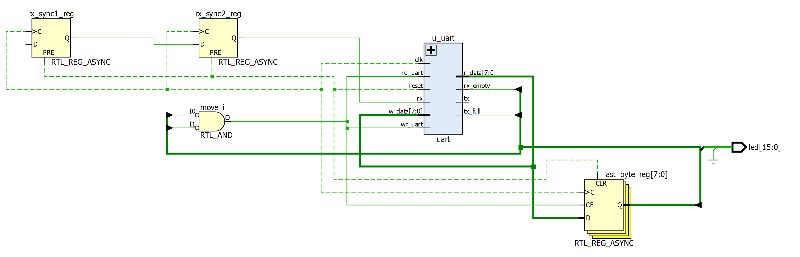
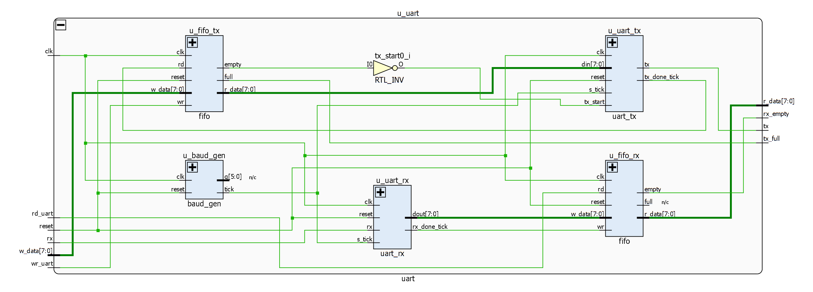
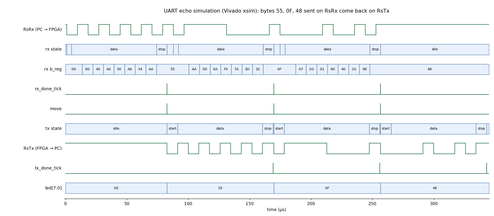

# UART Echo on the Basys 3 FPGA

**Verilog UART (115200 8N1) with RX/TX FIFOs on a Xilinx Artix-7, built and tested with Vivado 2023.2**

---

## Overview

The FPGA receives bytes from a PC over the Basys 3's USB-UART bridge and sends every byte straight back (an *echo*). The last echoed byte is also shown in binary on LEDs LD0–LD7.

The design is written from scratch in plain Verilog-2001, following the FSMD style from Pong P. Chu's *FPGA Prototyping by Verilog Examples*:

- a **baud-rate generator** that produces a 16× oversampling tick,
- a **UART receiver** and **transmitter**, each a 4-state FSM with datapath,
- two **16-byte FIFOs** that decouple receiving from transmitting,
- a **2-flip-flop synchronizer** on the asynchronous serial input.

The whole flow is scripted: one command each to create the Vivado project, simulate, build the bitstream and program the board, plus a Python script that tests the echo from the PC.

---

## System Block Diagram

```
PC  ──RsRx (B18)──▶  2-FF synchronizer
                          │
                          ▼
                  ┌─────────────┐  rx_done_tick   ┌──────────┐
                  │   uart_rx   │────────────────▶│ RX FIFO  │
                  │  (FSMD)     │      dout       │ 16 bytes │
                  └─────────────┘                 └────┬─────┘
                         ▲ tick                        │ r_data
                  ┌─────────────┐                      │  move = ~rx_empty & ~tx_full
                  │  baud_gen   │                      │  (pops RX, pushes TX, updates LEDs)
                  │ ÷54 → 16×   │                      ▼
                  └─────────────┘                 ┌──────────┐
                         ▼ tick       tx_start    │ TX FIFO  │
                  ┌─────────────┐◀────────────────│ 16 bytes │
                  │   uart_tx   │      din        └──────────┘
                  │  (FSMD)     │──tx_done_tick (pop)──▲
                  └──────┬──────┘
                         │
PC  ◀──RsTx (A18)────────┘

last echoed byte ──▶ led[7:0]     rx_empty ──▶ led[8]     tx_full ──▶ led[9]
```

**Life of one byte:** `uart_rx` finds the middle of each bit using 16 ticks per bit, shifts the 8 bits into a register and pulses `rx_done_tick`, which writes the byte into the RX FIFO. Because the RX FIFO is no longer empty, `move` pulses for one clock: that single pulse pops the RX FIFO and pushes the same byte into the TX FIFO. `uart_tx` sees a non-empty TX FIFO, sends start bit, 8 data bits (LSB first) and stop bit, then pulses `tx_done_tick` to pop the FIFO.

---

## Elaborated Design (Vivado RTL schematic)

**Top level:** input synchronizer, echo control (`move`), LED register and the UART core.



**UART core (`uart`):** baud generator, receiver, transmitter and the two FIFOs.



Inside the blocks:

| Block | Schematic |
|---|---|
| Baud-rate generator | [schematic_baud_gen.png](images/schematic_baud_gen.png) |
| Receiver FSMD | [schematic_uart_rx.png](images/schematic_uart_rx.png) |
| Transmitter FSMD | [schematic_uart_tx.png](images/schematic_uart_tx.png) |
| FIFO | [schematic_fifo.png](images/schematic_fifo.png) |

---

## Simulation

The self-checking testbench acts as the PC: it sends `0x55`, `0x0F` and `0x48` on `RsRx` at 115200 baud, decodes whatever comes back on `RsTx`, and prints PASS or FAIL.



You can see the receiver walk through `data` → `stop`, `b_reg` filling up bit by bit (`80, 40, A0 …` → `55`), the one-clock `rx_done_tick` and `move` pulses, and the transmitter starting its own frame right after. Byte 2 is already being received while byte 1 is still being sent; that overlap is what the FIFOs are for.

```
   164825 ns  echo 0: sent 55, got 55  OK
   251765 ns  echo 1: sent 0f, got 0f  OK
   338705 ns  echo 2: sent 48, got 48  OK
led[7:0] = 48 (last echoed byte), led[8] rx_empty = 1, led[9] tx_full = 0
RESULT: PASS
```

---

## Results

| | |
|---|---|
| Simulation | 3/3 bytes echoed correctly (Vivado xsim) |
| Timing | All constraints met at 100 MHz, WNS +5.576 ns |
| Resources | 72 LUTs, 77 flip-flops (< 0.4 % of the XC7A35T) |
| Hardware | Echo confirmed on a Basys 3 with a PC serial terminal at 115200 8N1 |

---

## Design Details

| Parameter | Value | Why |
|---|---|---|
| Clock | 100 MHz (pin W5) | Basys 3 oscillator |
| Serial format | 115200 baud, 8 data bits, no parity, 1 stop bit | Standard PC setting |
| Oversampling | 16 ticks per bit | Lets the receiver sample in the middle of each bit |
| Baud divisor | M = 54 → tick every 540 ns, bit = 8.64 µs | 100 MHz / (16 × 115200) = 54.25; 0.5 % error, well within UART tolerance |
| FIFO depth | 16 bytes each (`FIFO_W = 4`) | Absorbs bursts while the transmitter is busy |
| Reset | `btnC` (U18), active high, asynchronous | |

### Pin Mapping (`constraints/basys3.xdc`)

| Signal | Pin | Board function |
|---|---|---|
| `clk` | W5 | 100 MHz oscillator |
| `btnC` | U18 | Centre button (reset) |
| `RsRx` | B18 | USB-UART, PC → FPGA |
| `RsTx` | A18 | USB-UART, FPGA → PC |
| `led[7:0]` | U16 … V14 | Last echoed byte |
| `led[8]` | V13 | RX FIFO empty |
| `led[9]` | V3 | TX FIFO full |

---

## Repository Layout

```
rtl/
  top.v          board top: synchronizer, echo control, LEDs
  uart.v         structural wrapper: baud_gen + uart_rx + uart_tx + 2 FIFOs
  baud_gen.v     modulo-M counter, 16x baud tick
  uart_rx.v      receiver FSMD (idle/start/data/stop)
  uart_tx.v      transmitter FSMD (idle/start/data/stop)
  fifo.v         16-entry circular-buffer FIFO
sim/
  tb_top.v       self-checking testbench (used by the Vivado project)
  scratch/       same testbench for the quick command-line flow
constraints/
  basys3.xdc     pins, clock and configuration settings
scripts/
  run.bat        create | sim | build | program | all
  sim_echo.bat   quick xvlog/xelab/xsim run, optional waveform GUI
  *.tcl          Vivado batch scripts used by run.bat
  uart_test.py   PC-side echo test (pyserial)
images/          schematics and waveform shown above
```

Every source file is commented block by block.

---

## How to Use

Requirements: Vivado 2023.2 (`C:\Xilinx\Vivado\2023.2\bin` on `PATH`), a Basys 3, Python 3 with `pyserial`.

### Simulate

```bat
scripts\sim_echo.bat          :: compile + run, prints PASS/FAIL
scripts\sim_echo.bat gui      :: same, then opens the waveform viewer
```

Under the hood this is the standard three-step xsim flow, run in `build\xsim`:

```bat
xvlog ..\..\rtl\*.v ..\..\sim\scratch\tb_echo.v
xelab tb_echo -timescale 1ns/1ps -debug typical -s tb_echo_sim
xsim  tb_echo_sim -R
```

### Build and program

```bat
scripts\run.bat create        :: Vivado project in build\
scripts\run.bat build         :: synthesis + implementation + bitstream -> build\top.bit
scripts\run.bat program       :: program the board over JTAG
```

To use the GUI instead, open `build\uart_basys3\uart_basys3.xpr` in Vivado after `create`.

### Board setup

1. Jumper **JP2** on **USB**, **JP1** on **JTAG**.
2. Connect the micro-USB cable to **PROG/UART** and switch the board on.
3. Note the new **USB Serial Port (COMx)** in Device Manager.
4. Program the board. The green DONE LED lights and LD8 (RX FIFO empty) turns on.

### Test from the PC

```bat
python -m pip install pyserial
python scripts\uart_test.py --list
python scripts\uart_test.py COM5 --text "Hello FPGA"
```

Expected output: `sent: b'Hello FPGA'` / `recv: b'Hello FPGA'`.

Or use PuTTY / Tera Term: Serial, COMx, **115200**, 8 data bits, no parity, 1 stop bit, no flow control, local echo off. Every character you type comes back once, and LD0–LD7 show it in binary (`A` = `0x41` lights LD6 and LD0).

---

## Tools

Verilog-2001 · Vivado 2023.2 (synthesis, implementation, xsim) · Tcl · Python (pyserial) · Digilent Basys 3 (Artix-7 XC7A35T-1CPG236C)

## Reference

Pong P. Chu, *FPGA Prototyping by Verilog Examples*, Wiley, 2008 (FSMD coding style, UART and FIFO designs).
